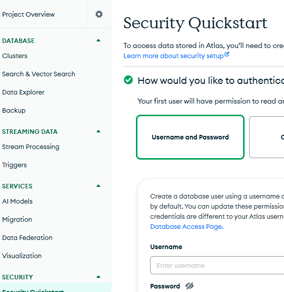
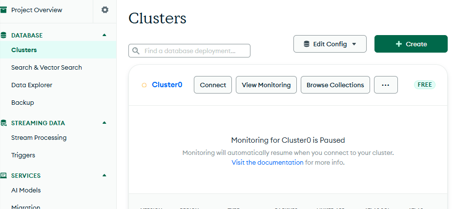
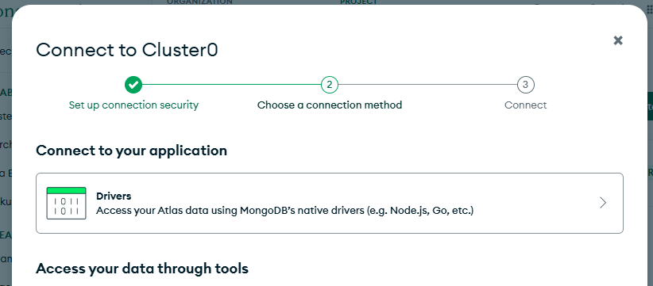
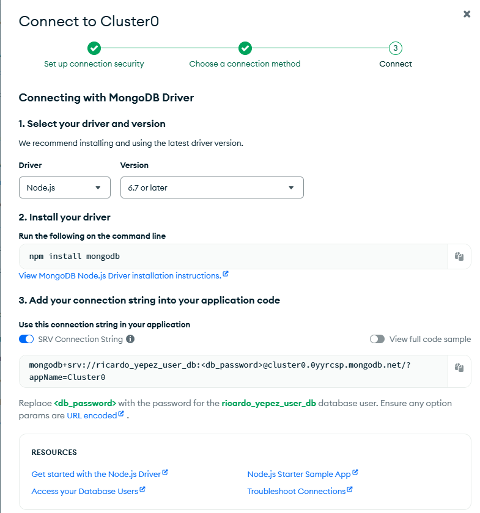

# Creando un Cluster en la Nube

1. En security select:
   
   * Username = ricardo_yepez_user_db
   * Login: 3R4y6on8724 

2. Para conectarnos vamos a la seccion de cluster y selecionamos connect:
    
3. Selecionamos `connect yo your application`
    
4. Copiar URL
5. 

